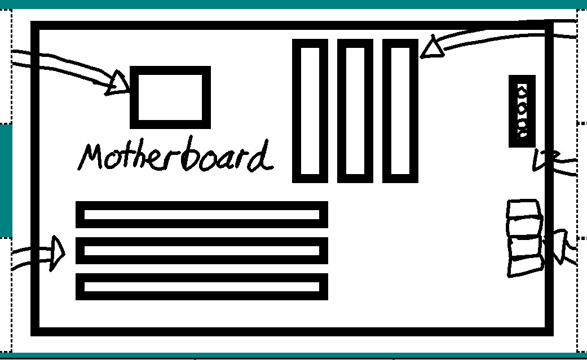
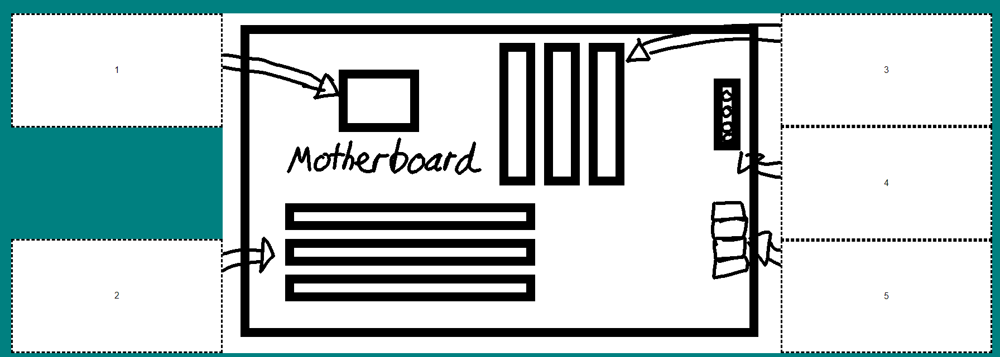
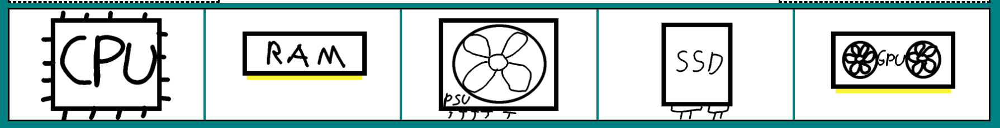
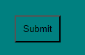
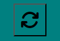
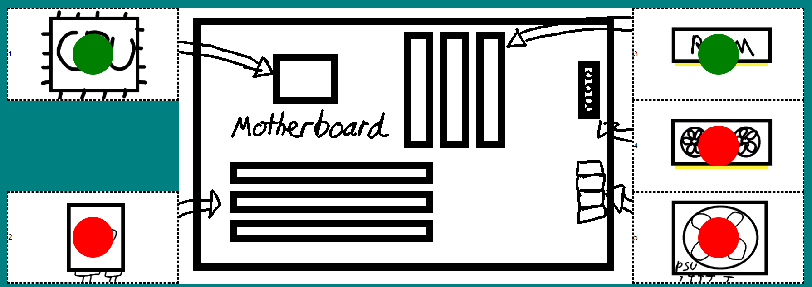
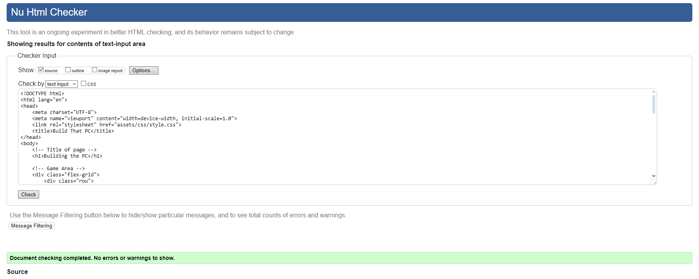
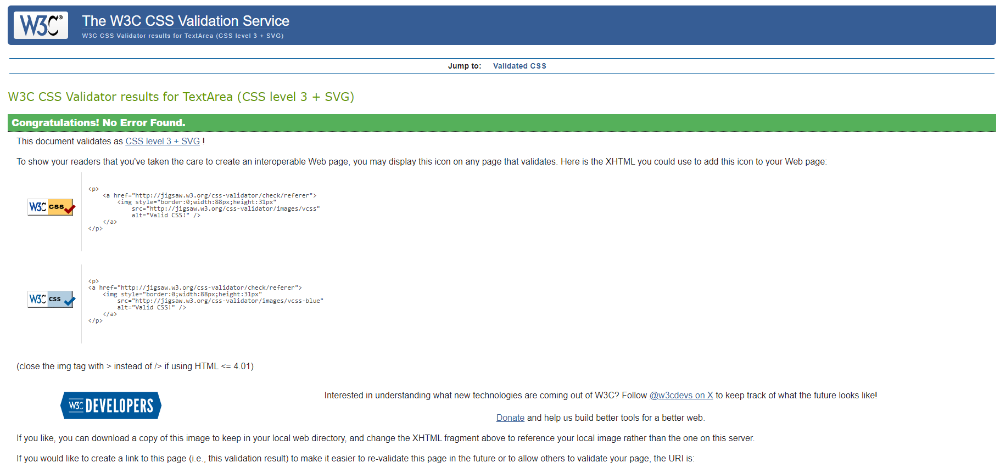
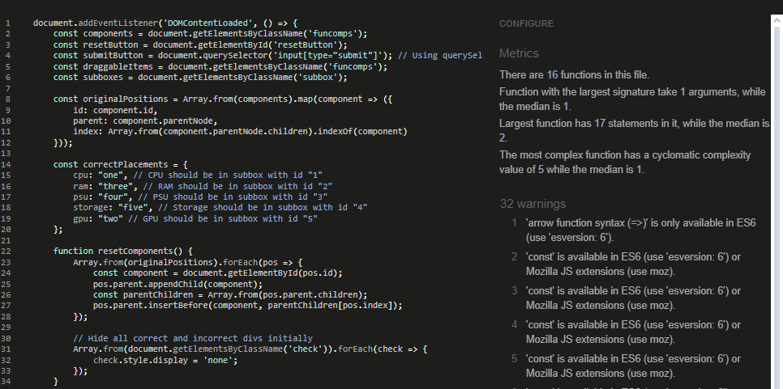
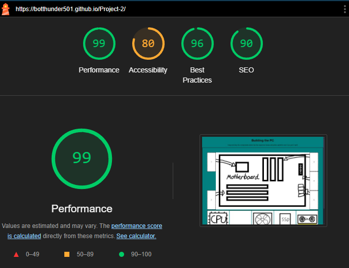

# Building the PC

## Table of Contents

- [Features](#features)
  - [The features in this website are as follows](#the-features-in-this-website-are-as-follows)
  - [Existing Features](#existing-features)
  - [Features Left to Implement](#features-left-to-implement)
- [Testing](#testing)
  - [User Story](#user-story)
  - [Validator Testing](#validator-testing)
- [Deployment](#deployment)
- [Credits](#credits)
  - [Content](#content)
  - [Media](#media)

This project was designed to follow up my first project about building PCs. The main premise is to teach users what components fits on a motherboard. The website is designed to be user-friendly and easy to navigate.

The user drags images from the button into boxes on either side of the main image. After dragging all the images to the relevant boxes, the user clicks the submit button and a visual feedback of either correct or incorrect is displayed, being green or red respectively.

Below is a wireframe of the concept of the page.

## Features

### The features in this website are as follows

The page consists of boxes that can be dragged and dropped into specifics boxes on either side of the main image. Two buttons, one for submitting your answers and one for resetting your answers. The main image is a visual representation of a motherboard. The boxes on the left and right are for the components that can be placed on the motherboard. The submit button will display a visual feedback of either correct or incorrect. The reset button will reset the page to its original state.

### Existing Features

- **Motherboard**
  - This is the main image that represents the motherboard. It is a visual representation of the motherboard and is used to help the user understand where the components go. It is a static image and does not change.
  
- **Submission Boxes**
  - On both sides of the main image are submission boxes. These are used to hold the components that the user has dragged and dropped into. They are used to display the components that the user has chosen and are used to display the visual feedback. They are dynamic and change based on the user's input.
  
- **Components**
  - Each component is a separate image that can be dragged and dropped into the submission boxes. They are used to represent the different components that can be placed on the motherboard. There are 5 components in total.
  
- **Submit Button**
  - This is used to submit the user's answers. When clicked, it will display a visual feedback of either correct or incorrect.
  
- **Reset Button**
  - This is used to reset the page to its original state. When clicked, it will reset the submission boxes and the visual feedback. It will also reset the components to their original positions. It is used to allow the user to try again.
  
- **Correct/Incorrect**
  - After the user has pressed the submit button, a visual feedback of either correct or incorrect will be displayed. This is used to let the user know if their answers are correct or not. It is a dynamic element and changes based on the user's input.
  

### Features Left to Implement

- Add accessibility options, change colours and text.
- Add an alert box to display if got all correct answers or some correct/incorrect.
- Clicking on the image will open in a new tab of the image but bigger.

## Testing

### User Story

### Validator Testing

- HTML
  - No errors were returned when passing through the official [W3C Validator](https://validator.w3.org)
  
- CSS
  - No errors were returned when pass through official [W3C Validcator CSS](https://jigsaw.w3.org/css-validator/)
  

- JavaScript
  - No errors were returned when pass through [JSHint](https://jshint.com)
  

- Lighthouse
  - Overall performance of website is good
  

## Deployment

- GitHub pages was used to deploy the website, instructions to deploy are as follows:
  - In the GitHub repository, navigate to the settings tab
  - On the left hand side, under code and automation, click on pages
  - Source is set to "Deploy from a branch", branch should be set to "main", then press save
  - After saved, go back to the main page and refresh after some time on the right hand side a successfull deployment will show

The link for the deployed website can be found here - [Building The PC](https://botthunder501.github.io/Project-2/)

## Credits

### Content

- The icons used in footer and content boxes were taken from [Font Awesome](https://fontawesome.com)

### Media

- The images of components and motherboard were drawn by me
